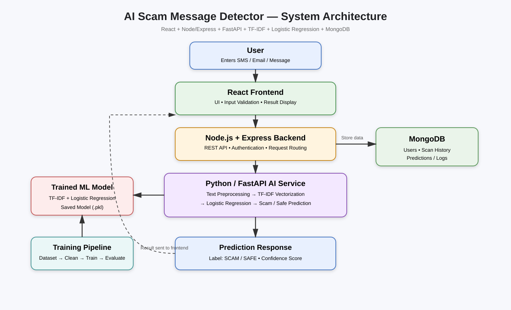

#  ScamShield AI

> A full-stack machine-learning application that analyses SMS, email, and chat messages and predicts whether a message is **SCAM** or **SAFE**.

ScamShield Ai demonstrates how a text-classification model can be integrated into a modern web application. The project combines a React frontend, a Node.js/Express backend, a Python/FastAPI AI service, and MongoDB in a modular, service-based architecture.

> **Project note:** The routes, folder structure, and setup commands below document the current recommended design. Confirm they match the final implementation before deployment or submission.

## Tech stack

| Area | Technologies |
| --- | --- |
| Frontend | React, Vite, JavaScript, CSS |
| Backend | Node.js, Express.js |
| AI service | Python, FastAPI |
| Machine learning | scikit-learn, TF-IDF, Logistic Regression |
| Database | MongoDB |
| Communication | REST / JSON |
| Development | VS Code, Git, GitHub |

## What it does

Users can submit suspicious messages for analysis. The application passes the text through the backend to the AI service, which uses TF-IDF vectorization and Logistic Regression to classify the message as **SCAM** or **SAFE** and return a confidence value.

### Key capabilities

- Analyse suspicious SMS, email, and chat messages.
- Predict whether a message is `SCAM` or `SAFE`.
- Return a prediction confidence value.
- Use REST APIs for communication between services.
- Train the classification model with Python and scikit-learn.
- Store users, scan history, and prediction logs in MongoDB.
- Keep the frontend, backend, and AI service modular.

## Architecture

```text
User
  │
  ▼
React + Vite frontend
  │
  ▼
Node.js + Express backend
  │
  ├──────────────► MongoDB
  │
  ▼
Python + FastAPI AI service
  │
  ▼
Text preprocessing
  │
  ▼
TF-IDF vectorizer
  │
  ▼
Logistic Regression
  │
  ▼
SCAM / SAFE + confidence
  │
  ▼
Backend → frontend → user
```

### System diagram



[Open the architecture diagram](docs/architecture.svg)


## Project structure

```text
ai-scam-message-detector/
├── frontend/                 # React + Vite client
├── backend/                  # Node.js + Express API
├── ai-service/               # Python + FastAPI ML service
│   ├── app/
│   ├── models/
│   ├── dataset/
│   ├── train.py
│   └── requirements.txt
├── docs/
│   └── architecture.svg
├── .gitignore
├── README.md
└── LICENSE
```


## Getting started

### Prerequisites

- Node.js and npm
- Python 3 and pip
- MongoDB

### 1. Clone the repository

Replace `YOUR_USERNAME` with your GitHub username.

```bash
git clone https://github.com/YOUR_USERNAME/ai-scam-message-detector.git
cd ai-scam-message-detector
```

### 2. Start the AI service

```bash
cd ai-service
python3 -m venv venv
source venv/bin/activate
pip install -r requirements.txt
```

Train the model:

```bash
python train.py
```

Start FastAPI:

```bash
python3 -m uvicorn app.main:app --reload --port 8000
```

The AI API runs at:

```text
http://localhost:8000
```

### 3. Start the backend

Open another terminal and run:

```bash
cd backend
npm install
npm run dev
```

Example backend URL:

```text
http://localhost:5000
```

Create `backend/.env`:

```env
PORT=5000
MONGODB_URI=mongodb://127.0.0.1:27017/scamshield
AI_SERVICE_URL=http://localhost:8000
```

### 4. Start the frontend

Open another terminal and run:

```bash
cd frontend
npm install
npm run dev
```

Vite normally provides a local URL similar to:

```text
http://localhost:5173
```

## API reference

The routes below define the recommended contract between the frontend, backend, and AI service. Adjust them to match the final implementation if necessary.

### AI service

#### Health check

```http
GET /health
```

Example response:

```json
{
  "status": "ok"
}
```

#### Predict a message

```http
POST /predict
Content-Type: application/json
```

Example request:

```json
{
  "message": "Congratulations! You won a prize. Click this link now."
}
```

Example response:

```json
{
  "prediction": "SCAM",
  "confidence": 0.97
}
```

> The example confidence value illustrates the response format; it is not a published model-performance metric.

### Backend API

#### Analyse a message

```http
POST /api/messages/analyze
Content-Type: application/json
```

Example request:

```json
{
  "message": "Your account has been selected for a reward. Verify immediately."
}
```

Example response:

```json
{
  "prediction": "SCAM",
  "confidence": 0.95
}
```

#### Scan history

```http
GET /api/messages/history
```

Returns previously analysed messages for the authenticated user.

## Machine-learning pipeline

```text
Dataset
   ↓
Text cleaning
   ↓
Train/test split
   ↓
TF-IDF vectorization
   ↓
Logistic Regression
   ↓
Model evaluation
   ↓
Save model
   ↓
FastAPI prediction API
```

Recommended evaluation metrics:

- Accuracy
- Precision
- Recall
- F1-score
- Confusion matrix

## Security notes

Never commit:

- `.env` files
- API keys
- MongoDB credentials
- Access tokens
- Private credentials
- Generated model or data files containing sensitive information

Validate and sanitize user input on the backend. Review configuration and logging carefully when messages or user data may be sensitive.

## Testing

Recommended test coverage:

```text
Frontend → UI/input tests
Backend  → API/integration tests
AI       → model/API prediction tests
```

## Future improvements

- Transformer/BERT-based classification
- Multilingual scam detection
- URL reputation checking
- Explainable AI indicators
- Email header analysis
- Real-time browser/mobile integration
- User feedback for model improvement
- Admin dashboard and analytics

## Academic project

- Full-stack development
- REST APIs
- Machine learning
- Natural language processing
- Database integration
- Software architecture

## License

MIT License
